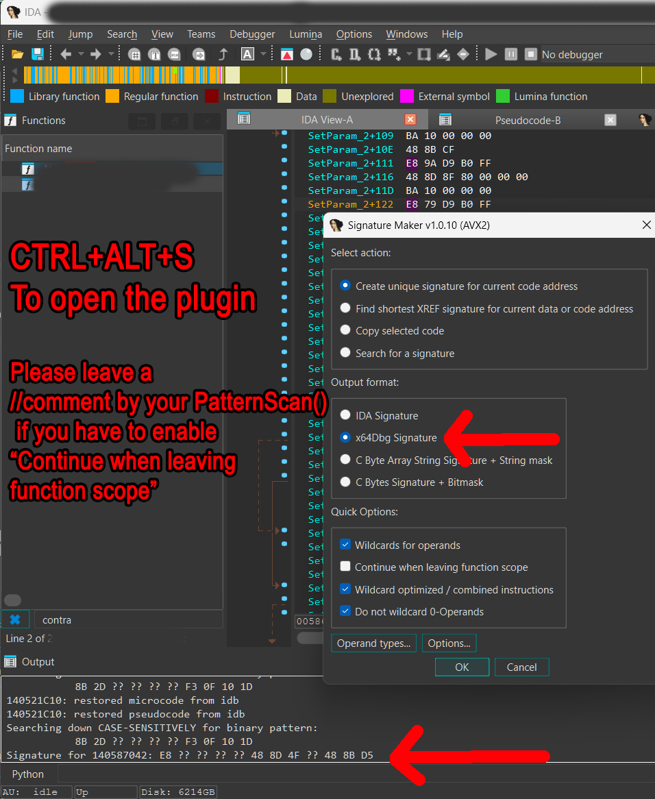

# Contributing Guidelines

Please make all pull requests towards the GitHub repo located at https://github.com/ShizCalev/MGSHDFix.git

Pull requests made to the GitLab mirror will not be watched unless the main repository is offline.


## `PatternScan(void* module, const char* signature, const char* prefix)`
Memory patterns should be found via x64Dbg style unique memory pattern signatures as opposed to hardcoded memory locations when possible.

These unique patterns wildcard relative memory offsets + immediate values which change every time the game updates. This hardens the codebase against needing patches every time a game update releases.

**Example:**
`8B 2D 33 D7 2B 01`

**Becomes the following unique signature:**
`8B 2D ?? ?? ?? ?? F3 0F 10 1D`

**IDA Plugin:**
https://github.com/A200K/IDA-Pro-SigMaker

Please make an explicit note beside a function if you have to enable "Continue when leaving function scope". While the game typically does not move functions around greatly between game updates, this helps with troubleshooting if a game update breaks something.



<br>

**prefix**
PatternScan() has built in logging in the event a pattern scan fails to find a memory address.

If you need to enable this logging, in the MGSHDFix Config Tool, go to `MGSHDFix / Internal` -> `Internal Settings` -> `Debug Logging`


<br>

## `PatternScanSilent`
Disables PatternScan's built in logging, useful if you want to have your own unique log messages, i.e. you're verifying that a memory pattern does NOT exist.


<br>

## Hooking Macros

Several helper macros are provided to help condense repeated code & standardize logging messages.

**Example:**

```cpp  
if (uint8_t* LevelTransitionResult = Memory::PatternScan(baseModule, "89 5F ?? E9 ?? ?? ?? ?? 39 1D", "GameVars: Level Transition"))
{
	static SafetyHookMid levelTransitionMidHook {};
	levelTransitionMidHook = safetyhook::create_mid(LevelTransitionResult,
		[](SafetyHookContext& ctx)
		{
			OnLevelTransition();
		});
	if (levelTransitionMidHook)
	{
		if (g_Logging.bVerboseLogging)
		{
			spdlog::info("levelTransitionMidHook: Hook installed.", prefix);
		}
	}
	else
	{
		spdlog::error("levelTransitionMidHook: Hook failed.", prefix);
	}
}
```

Can all be condensed with the `LOG_HOOK` macro into:

```cpp  
if (uint8_t* LevelTransitionResult = Memory::PatternScan(baseModule, "89 5F ?? E9 ?? ?? ?? ?? 39 1D", "GameVars: Level Transition"))
{
	static SafetyHookMid levelTransitionMidHook {};
	levelTransitionMidHook = safetyhook::create_mid(LevelTransitionResult,
		[](SafetyHookContext& ctx)
		{
			OnLevelTransition();
		});
	LOG_HOOK(levelTransitionMidHook, "GameVars: Level Transition")
}
```  

or even more simply condensed with the `MAKE_HOOK_MID` macro into:

```cpp  
MAKE_HOOK_MID(baseModule, "89 5F ?? E9 ?? ?? ?? ?? 39 1D", "GameVars: Level Transition", {
	OnLevelTransition();
	});
```

Please make sure that all hooks have proper logging for if the memory pattern / hook fails to setup, this greatly expedites troubleshooting when things (potentially) break between game updates.


<br>

## Reusable Game Variables (ie Cutscene active flag, ActorWaitValue, etc)
Commonly used game variables are located in GameVars.cpp.

https://github.com/Lyall/MGSHDFix/blob/master/src/resources/gamevars.cpp

If you're adding a variable which has obvious re-usage potential for other fixes in the future, add it to GameVars unless there's a valid reason you need it isolated to a specific TU. ♥


<br>


## Translation Units
Features / fixes are grouped into their own translation units to help with compilation times, & to make things faster to find. (dllmain.cpp used to be over 8000 lines alone.)

If a fix only applies to a single game, preferably prefix the cpp/hpp file for it with the game's abbreviation, i.e. `MGS2_Sunglasses.cpp` to aid in quick visual identification.


<br>

## Debugging Features

> [!NOTE]
> A unified `.props` setup for the project is currently being worked on.
> Until then, change:
> 
> `#if !defined(RELEASE_BUILD)`
> 
> to:
> 
> `#if defined(RELEASE_BUILD)`
> 
> in `helper.hpp` to enable these debugging helpers.


#### `void DumpContext(const safetyhook::Context& ctx);`

Dumps the current contents of all registers at the time of call.
	
```
[2026-05-07 08:41:26.013] [info]
RAX = 0x400	| RBX = 0x0	| RCX = 0x20	| RDX = 0x19A00D0D400
RSI = 0x0	| RDI = 0x19A00D0D320	| RBP = 0x7A0D70F7F0	| RSP = 0x7A0D70F6F0
R8  = 0x1	| R9  = 0x19A00D0D3F0	| R10 = 0x18	| R11 = 0x7FF78D8E5380
R12 = 0x19A00D0D800	| R13 = 0x1	| R14 = 0x19A00D0D400	| R15 = 0x20
RIP = 0x7FF78C240322
XMM0 = 0	| XMM1 = -6.51042e-05	| XMM2 = 305220	| XMM3 = 72638.2
XMM4 = 28442.8	| XMM5 = 295220	| XMM6 = -0	| XMM7 = 65138.2
XMM8 = nan	| XMM9 = 1	| XMM10 = 1	| XMM11 = 2.32831e-10
XMM12 = 315220	| XMM13 = 80138.2	| XMM14 = 38442.8	| XMM15 = 300
```


#### `void DumpBytes(uintptr_t address, size_t count);`
Dumps (count) number of bytes at a given memory location, and the offset to those bytes to expedite development.

```
[2026-05-07 08:42:58.522] [info] Bytes at 0x7FF78C532EDA:
[2026-05-07 08:42:58.522] [info]   +0x00: 0x48
[2026-05-07 08:42:58.522] [info]   +0x01: 0x8B
[2026-05-07 08:42:58.522] [info]   +0x02: 0x4D
[2026-05-07 08:42:58.522] [info]   +0x03: 0xC0
[2026-05-07 08:42:58.522] [info]   +0x04: 0x48
```

<br>

<br>


## URL Opening
Opening URLs on Steam Deck typically leads to the user being stuck on a black screen. 

Please check IsSteamOS() whenever opening URLs to ensure that URLs aren't opened directly on Steam Deck.


<br>

<br>

------------

<br>

<br>

# Style Guide


These guidelines primarily exist to keep the codebase tidy, consistent, and easy to navigate at a glance.

## Logging  
  
Prefer explicit logging messages that clearly identify the system, hook, or feature involved.  
  
This helps identify breakages after game updates.

```cpp  
spdlog::info("Resolution Scaling Fixes: HUD scaling hook installed.");  
spdlog::error("MGS2: Rain effect pattern scan failed.");  
spdlog::warn("GameVars: Cutscene state pointer was null.");
```

**Avoid:**
```cpp
spdlog::info("Success");
spdlog::error("Failed");
spdlog::info("broke");
```

## Bracing Style

Place braces on new lines.

**Preferred:**

```cpp
if (value)
{
    DoThing();
}
```

**Avoid:**

```cpp
if (value) {
    DoThing();
}
```

## Single-Line Conditionals

Avoid single-line conditionals.

**Preferred:**

```cpp
if (!player)
{
    return;
}
```

**Avoid:**

```cpp
if (!player) return;
```

## Memory Addresses

Prefer unique pattern scans over hardcoded memory addresses whenever possible, as hardcoded addresses are fragile across game updates.

**Preferred:**

```cpp
Memory::PatternScan(baseModule, "8B 2D ?? ?? ?? ?? F3 0F 10 1D", "Example");
```

**Avoid:**

```cpp
reinterpret_cast<void*>(0x140123456);
```

## Magic Numbers

Prefer clearly named `constexpr` definitions instead of vague magic numbers.

**Preferred:**

```cpp
constexpr float rain_slow_multiplier = 0.5f;
velocity *= rain_slow_multiplier;
```

**Avoid:**

```cpp
velocity *= 0.5f;
```

## Early Returns

Prefer early returns/guard clauses to reduce nesting depth and improve readability.

**Preferred:**

```cpp
if (!renderer)
{
    return;
}

if (!renderer->device)
{
    return;
}

if (!renderer->device->initialized)
{
    return;
}

RenderFrame();
```

**Avoid:**

```cpp
if (renderer)
{
    if (renderer->device)
    {
        if (renderer->device->initialized)
        {
            RenderFrame();
        }
    }
}
```


## Anonymous Namespaces

Prefer anonymous namespaces in translation units over `static` globals/functions for internal linkage.

**Preferred:**

```cpp
namespace
{
    constexpr float rain_slow_multiplier = 0.5f;

    void UpdateRain()
    {
    }
}
```

**Avoid:**

```cpp
static constexpr float rain_slow_multiplier = 0.5f;

static void UpdateRain()
{
}
```


## Naming

Prefer descriptive names over abbreviations whenever possible.

**Preferred:**

```cpp
float rain_slow_multiplier;
uintptr_t splash_effect_address;
```

**Avoid:**

```cpp
float rsm;
uintptr_t addr2;
```
