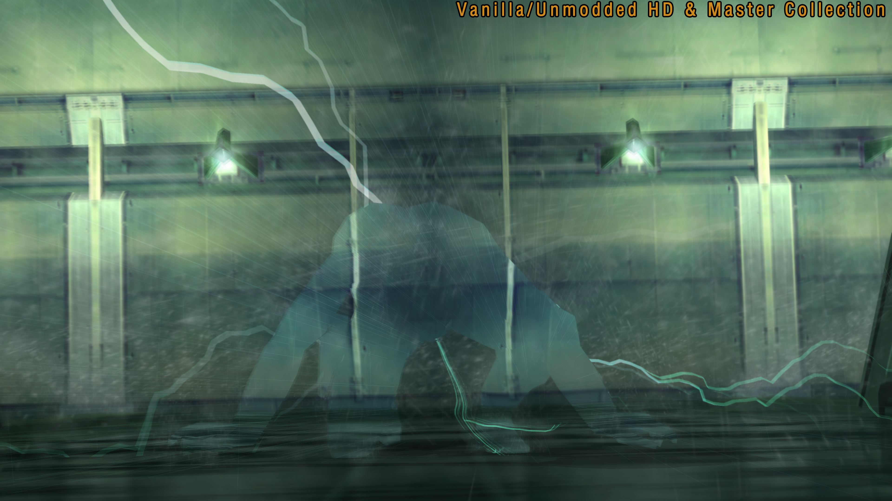
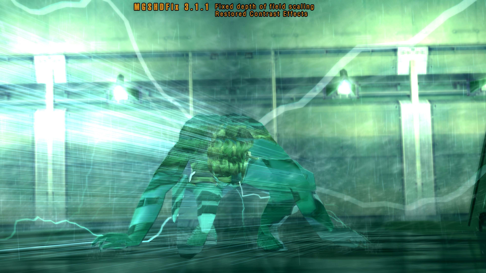
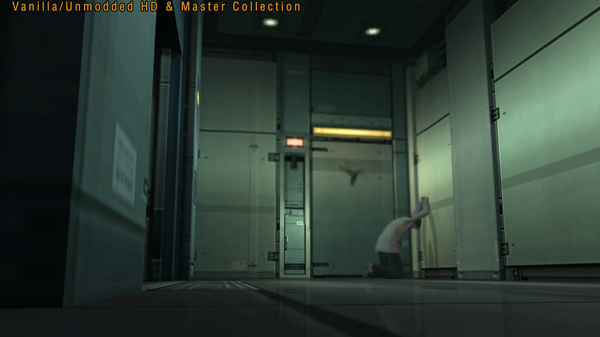
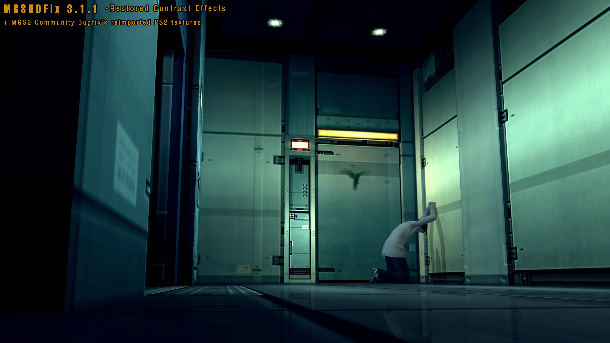
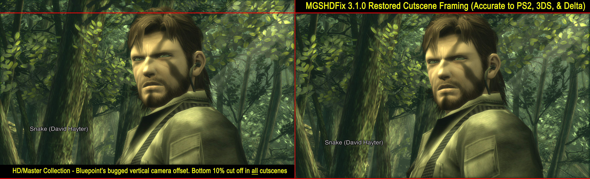
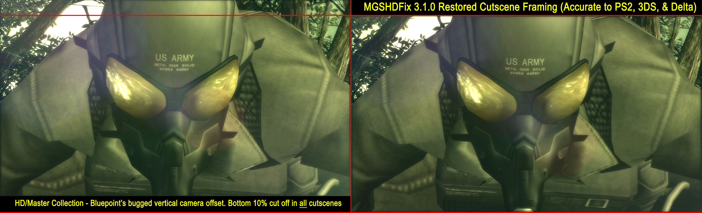

# Metal Gear Solid Master Collection Fix
[](https://github.com/ShizCalev/MGSHDFix/releases) [](https://github.com/ShizCalev/MGSHDFix/releases)  

[](https://discord.gg/bFv9bZmWDV)


[MG1 / MG2 Nexus Page](https://www.nexusmods.com/metalgearandmetalgear2mc/mods/9) | [MGS2 Nexus Page](https://www.nexusmods.com/metalgearsolid2mc/mods/49) | [MGS3 Nexus Page](https://www.nexusmods.com/metalgearsolid3mc/mods/139) | **GitHub Repo (You're already here!)** | [GitLab Repo Mirror](https://gitlab.com/ShizCalev/MGSHDFix/)<br />

This is a fix that adds custom resolutions, ultrawide support and much more to the Metal Gear Solid Master Collection.<br />

**Featured by**:  
[IGN (Video Guide)](https://www.ign.com/videos/how-to-fix-the-metal-gear-solid-master-collection-on-pc-with-mods) • [IGN (Best Mods List)](https://www.ign.com/wikis/metal-gear-solid-master-collection-vol-1/Best_Mods) • [Digital Foundry / Eurogamer](https://youtu.be/zkdxOQ2kGMc?t=536) • [PC Gamer](https://www.pcgamer.com/it-only-took-hours-for-modders-to-crowbar-4k-support-into-the-metal-gear-solid-master-collectionnow-theyve-added-ultrawide-high-res-ui-support-and-more/) • [Rock Paper Shotgun](https://www.rockpapershotgun.com/modders-polish-metal-gear-solids-pc-master-collection-with-ultrawide-support-sharper-textures-and-more) • [Ocelot (YouTube)](https://www.youtube.com/watch?v=CwgWJgc58_4) • [GamingOnLinux](https://www.gamingonlinux.com/2023/11/modders-already-improving-the-metal-gear-solid-master-collection/) • [Dextero](https://www.dexerto.com/tech/metal-gear-solid-master-collection-pc-modders-are-fixing-konamis-mistakes-2380637/)


## Games Supported
- Metal Gear 1/2 (MSX)
- Metal Gear Solid 2
- Metal Gear Solid 3

## Other Metal Gear Fix Projects
- MGS Master Collection - Metal Gear Solid 1 and Bonus Content (MG1/2 NES) | MGSM2Fix - [Repo](https://github.com/nuggslet/MGSM2Fix) / [Nexus Page](https://www.nexusmods.com/metalgearsolidmc/mods/5)
- Metal Gear Solid V: The Phantom Pain | MGSVFix - [Repo](https://codeberg.org/Lyall/MGSVFix)
- Metal Gear Solid Delta: Snake Eater | MGSDeltaFix - [Repo](https://codeberg.org/Lyall/MGSDeltaFix) / [Nexus Page](https://www.nexusmods.com/metalgearsoliddeltasnakeeater/mods/27)

## Features
> [!NOTE]
(More features and fixes are added frequently and may be missing from this list.)

#### Shared Engine Features:
- Custom resolution/ultrawide support.
- Experimental 16:9 HUD option that resizes HUD/movies (MGS2/MGS3).
- Borderless/windowed mode.
- Mouse cursor toggle.
- Launcher skips (see Config Tool to configure).
- Option to disable pausing on alt-tab.
- Option to disable bilinear texture filtering, giving the games a pixel art/retro appearance. [PR #138](https://github.com/ShizCalev/MGSHDFix/pull/138)
- Increased texture size limits (MG1/MG2/MGS3).
- Adds support for custom PS2 controller glyphs without overwriting existing textures.
- Option to continue aiming your gun after firing it while in first-person/while holding lock-on.
- Toggleable wireframe modes.
- Option to force highest level polygon models during gameplay & cutscenes (improving visual quality.)
- Adjustable anisotropic filtering (MGS2/MGS3).
- Skip intro logos (MGS2/MGS3).
- Option to disable 2011 HD Collection gameplay camera angle/positioning changes.
- Option to adjust scale and opacity of cutscene captions.
- Option to disable Steam Achievement unlocking. (For speedrunners.)
- SMAA (Screen Morphological Anti-Aliasing) support (MGS2/MGS3).
- Gamma correction for all games, correcting colors to appear more vibrant and making some lower blacks even deeper, as they would have appeared on an actual CRT screen.
- Option (MGSHDFix Internal tab) to start MGS2 & MGS3 in their developer menu level select screens.
- Speedrunner In-Game Timer / statistics overlay
- Option to restore PS2 memory card strings / messages / captions.

#### MG / MG2 Specific Features
- Option to crop overscan borders on the top/bottom of the screen.
- Option to correct the game to a 4:3 aspect ratio. (The game was using the MSX2's raw output aspect ratio of 64:53.)

#### MGS2 Specific Features:
- Option to enable Bluepoint's cancelled Subsistence style Third Person view camera.
- Option to enable Bluepoint's cancelled First Person Shooter camera.
- Option to restore 2001 Japanese Sons of Liberty phone ringtone.
- Option to restore PlayStation 2 Solidus choking durations & health reduction (rebalanced in the HDC.)
- Option to force Snake / Raiden to wear their sunglasses (and outright disable their sunglasses.)
- Option to force Real Time Clock based hostage Easter Egg.
- Option to restore grenade cooking (having detonation timer start while the grenade is still held.)
- Option to swap X/O (OK / CANCEL inputs) in Menus.
- Option to swap thermal goggle color palettes in realtime (Substance/vanilla, red hot / Sons of Liberty, Splinter Cell Blacklist, black hot, white hot), using Numpad 7 while thermals are equipped. [Examples](https://imgur.com/a/ThRpIbj)
- Option to enable cut Metal Gear 2: Solid Snake Colonel sprites during some late-game Codec calls. [PR #234](https://github.com/ShizCalev/MGSHDFix/pull/234)
- Option to restore original 2001 Sons of Liberty radar rotation. [Example](https://imgur.com/a/QNDTgrO)
- BP_Asset / Manifest file modloader support. [PR #251](https://github.com/ShizCalev/MGSHDFix/pull/251)
- Option to render shell casings at all distances.
- Option to have shadow resolution (which was hard-coded to the PS2's 256x256 size) increase dynamically with game resolution.
- Option to enable radar in Snake Tales.
- Option to set a custom lifebar name.
- Option to have the lifebar name reflect the current player character's name, like in MGS3/MGS4.
- Option to restore Sons of Liberty's elevator glitch, for speedrunners that want to practice old strats that were patched out.
- Option to make punches count as non-lethal damage against Vamp instead of doing lethal damage.
- Option to force all NPCs to always use their highest quality polygon/LOD model.


#### MGS3 Specific Features:
- Option to force grass to render at all distances.
- Mouse sensitivity adjustment.


## Bug Fixes
#### Shared Engine Bugs:
- Fixes hundreds of typos across both MGS2 & MGS3.
- Fixes idle wait issue, dramatically reducing CPU usage - increasing game performance. [PR#225]
- Fixes the collection's games sometimes defaulting to integrated graphics processors on systems with multiple GPUs (due to Nvidia/AMD driver misconfiguration.)
- Fixes gameplay/cutscene aspect ratio for ultrawide resolutions (MGS2/MGS3).
- Fixes window size on displays with High DPI scaling enabled. [PR #127](https://github.com/ShizCalev/MGSHDFix/pull/127)
- Fixes the monitor going to sleep during long cutscenes (for Windows only, Linux needs to be [fixed by Valve](https://github.com/ValveSoftware/Proton/issues/8881).
- Fixes the bug where your character would start aiming right away after re-equipping a gun that was drawn when you put it away. 
- Fixes vector effects / line based rendering scaling (ie rain, lasers, bullet trails.) [PR #140](https://github.com/ShizCalev/MGSHDFix/pull/140)
- Fixes UI scaling. [PR #181](github.com/ShizCalev/MGSHDFix/pull/181)
- Option to force the game to output stereo audio, which corrects the infamous ["rain is louder than codec conversations"](https://www.pcgamingwiki.com/wiki/Metal_Gear_Solid_2:_Sons_of_Liberty_-_Master_Collection_Version#Rain_audio_is_significantly_louder_than_codec_conversations_.26_other_game_sounds) issue. [PR #162](https://github.com/ShizCalev/MGSHDFix/pull/162)
- Restores close-up camera blur / depth of field, outright disabled in MGS2 & MGS3 by the 2011 HD Collection.
- Fixes MGS2 & MGS3's audio reverb being nearly inaudible; volume is now boosted and user-adjustable.
- Fixes MGS2 & MGS3's blind rendering (lines on Codec portraits / nightvision / thermal goggles) not scaling with resolution.
- Rewrites some game functions to speed up processing. ♥


#### MGS2 Specific Bug Fixes:
- Restores numerous strings that were changed in the HDC due to TRC game certification restrictions.
- Restores contrast / color filter post processing effects in numerous cutscenes, which have been broken/missing since the 2011 HD Collection. [Examples (SPOILER WARNING)](https://imgur.com/a/pJAc8H1)
- Restores broken heat haze post processing effect on roof of Strut A.
- Restores underwater UI swimming post processing effect. [PR #245](https://github.com/ShizCalev/MGSHDFix/pull/245)
- Restores numerous particle and visual effects to proper PS2 timing, fixing effects that ran at double speed and ended too early in the HD Collection and Master Collection versions.
- Restores dogtag viewer information.
- Restores color swapping Red / Blue "2" on the title screen after game completions. (Requires MGS2 Community Bugfix Compilation)
- Fixes in-game timer not pausing during loading times. (This was a HD Collection regression. IGT behavior now matches with Substance. Can be disabled for those that want the vanilla/broken behavior.)
- Fixes Depth of Field / blur post processing effects not scaling with resolution. [PR #248](https://github.com/ShizCalev/MGSHDFix/pull/248)
- Fixes shadow resolution not scaling with game resolution. (It was hard-coded to 256x256 / PS2 resolution.)
- Fixes incorrectly positioning "Metal Gear Solid 2" title card during the start of Tanker when playing in Letterbox mode. [Example](https://imgur.com/a/bGkGwJ9)
- Fixes crashes, audio desync, timer delays, and broken loading zones bugs caused by alt-tabbing the game. (For speedrunners who utilize this bug to skip forced codec calls, this bugfix can be forced off in the ini.)
- Fixes the Steam Cloud related ["DAMAGED SAVE" / "CORRUPT SAVE"](https://www.pcgamingwiki.com/wiki/Metal_Gear_Solid_2:_Sons_of_Liberty_-_Master_Collection_Version#Save_File_Appears_as_DAMAGED_FILE) issue. 
- Fixes bug where your character would stop aiming their gun while holding L1 when you fully tilt your joystick.
- Fixes typos in several Snake Tales missions, and in the in-game novel "In The Darkness of Shadow Moses". [PR#201](https://github.com/ShizCalev/MGSHDFix/pull/201)
- Fixes optical camouflage refraction effects. [PR#228]
- Fixes unique Metal Gear Ray unit numbers not properly updating. [PR#229]
- Fixes Harrier not properly updating damaged state textures. [PR#229]
- Fixes coolant not fogging up breakable mirrors / glass. [PR#231]
- Fixes coolant glass fog appearing as hot in thermal goggles. [PR#232]
- Fixes sensor-A Bomb radar overlay moving as the player moves.
- Fixes broken sun reflections / sparkles during a lategame cutscene. [Spoilers](https://imgur.com/a/YSQR3xh)
- Fixes broken Colonel MGS1/Ghost Babel sprites. [Example](https://i.imgur.com/w5khi5r.jpeg)
- Fixes incorrect audio location when Solidus strikes Raiden with his tentacle arms. [PR#227]
- Fixes Shell 1 B2 Computer Room parrot's radar cone not turning to face the player.
- Fixes invisible shell casing in cutscenes.
- Fixes hostages having incorrectly colored hands in Shell 1 Core. (Requires MGS2 Community Bugfix Compilation) [PR #247](https://github.com/ShizCalev/MGSHDFix/pull/247)
- Fixes incorrect screen texture during a Shell 1 core cutscene. (Requires MGS2 Community Bugfix Compilation) [PR #247](https://github.com/ShizCalev/MGSHDFix/pull/247)
- Restores crossfade camera transitions.
- Restores overcranked (slow-motion) cinematic camera transitions (Plant opening, Fortune's intro cutscene, several others).
- Restores PS2 motion blur / motion trails.
- Restores out-of-focus (concentration) camera blur.
- Restores heat distortion effects in numerous cutscenes (helicopter heat exhaust, Solidus heat mirage, etc.)
- Restores multiple underwater screen distortion effects.
- Restores bloodstains on guards & RAY units when shot.
- Restores scope distortion when using the PSG-1 / PSG-1T.
- Restores water droplets on the camera during first-person-view cutscenes.
- Restores several invisible water splash effects.
- Fully restores Name, Date of Birth, and Bloodtype entry screens, and the end-game dogtag.
- Fixed cigarette smoke in the Tanker intro not acting like smoke.
- Fixed RAY's eye trails being misaligned during the final Arsenal cutscene.
- Fixed sun god-rays / flare not rendering properly in several cutscenes. (This made the oil cloud during the underwater part of the Plant opening cutscene seem invisible.)
- Restored alternative voice lines when Snake is taking photos in Holds 3.
- Restored the Main Menu's voiceovers & Action Level selection screens.
- Fixed Fortune's railgun having corrupt geometry (which looked like a smoke cloud) when fired.
- Fixed Fortune's railgun arcing effects not scaling with resolution.
- Fixed incorrect lighting on several posters & lockers/doors.
- Corrected a camera jitter issue during in-game demos (such as viewing the Soldier at the very start of Plant) which was obvious at high resolution.
- Fixed a model lighting bound calculation bug introduced by the 2011 HD Collection, which caused a green tint on the computers in the Shell 1 Core B2 Computer Room and left numerous models throughout Arsenal unshaded.
- Fixed a 60 FPS camera-sync issue which caused the Kasatka's rotor blades to appear static / not moving during cutscenes.
- Fixed the laser on several guns being incorrectly positioned compared to their laser aiming module.
- Fixed Raiden's holster not updating when the M9 is equipped.
- Corrected Snake's hair rendering order; Snake's hair is no longer see-through / rendering behind itself, removing the need for the separate Snake hair fix mod.
- Fixed Snake visibly teleporting during the Tanker intro cutscene.
- Fixed Snake's optical camo breaking effect's rotation during the Tanker intro cutscene.
- Fixed MG Ray's eye sprites being massive / having blown out bloom.
- Fixed a broken voice line in Deck 2's pipe-falling mini-cutscene.
- Made Snake's holster functional. (His holster always had an extra handgun in it, even when unarmed. Requires MGS2 Community Bugfix Compilation)
- Fixed Solidus not being visible when viewed from a malfunctioning RAY unit's POV. (Requires MGS2 Community Bugfix Compilation)


#### MGS3 Specific Bug Fixes:
- Restores the PlayStation 2's original cutscene camera/viewport height, fixing the 2011 HD Collection bug that cropped roughly the bottom 10% of the image in all cutscenes. (Notably, this issue was officially fixed in both the 3DS remake and Delta.)
- Fixes water reflections (MGS3). See [PR #71](https://github.com/ShizCalev/MGSHDFix/pull/71) for a breakdown of the issue.
- Fixes Depth of Field / blur post processing effects not scaling with resolution.
	- Depth of field rendering has been upgraded to utilize a gaussian pyramid to clean up PS2 sampling artifacts. ♥
- Restored cutscene film-grain rendering during low-light camera shots.
- Fixes misaligned NVG crosshairs.
- Fixes misaligned NVG & Thermal goggle angle indicator.


## Logging / Warnings for Common Configuration Issues
- Warnings for common mod compatibility & installation issues - which often result in crashes.
- Warnings if your game's audio is muted via the game's main launcher.
- Logging for Steam Input's controller status (ie detected controllers, keybinds, ect.)
- Added a warning if Windows Multi-Plane Overlay is disabled, which can cause DirectX games to freeze/crash when alt-tabbing.


## Installation

> [!NOTE]
🚩 **If updating from a previous version of MGSHDFix:**
- Delete `d3d11.dll` from your game folder.
- Delete old MGSHDFix files (e.g., `MGSHDFix Config Tool.exe` and `MGSHDFix.asi`) before installing the update.

### Steps:
1. Grab the latest release of MGSHDFix from [here.](https://github.com/ShizCalev/MGSHDFix/releases)
2. Extract the contents of the release zip into your game folder.
   - (e.g., `steamapps\common\MGS2` or `steamapps\common\MGS3` for Steam.)
3. Set both "Internal Resolution" & "Internal Upscaling" to Default / Original in the game's launcher. (Resolution is entirely handled by MGSHDFix.)
4. Launch the MGSHDFix Config Tool (in the game's /plugins folder) to generate a settings file if you're installing the mod for the first time.

### Steam Deck/Linux Additional Instructions

> [!NOTE]
**🚩 These steps are only needed if you’re on Steam Deck/Linux. Skip if you’re using Windows.**

- Open up the game properties of either MGS2/MGS3 in Steam and add the following line to the launch options:

      WINEDLLOVERRIDES="wininet,winhttp=n,b" %command%

- MGSHDFix's Config Tool requires **ProtonTricks** to be installed via Linux's **Discover** software store.
- When opening the MGSHDFix Config Tool on Steam Deck/Linux, a Proton Tricks Wine Prefix window will pop up. Select any game and hit "OK" to open the MGSHDFix Config Tool.
   - If you do not have any games in the list, or the MGSHDFix Config Tool fails to launch, add it as a non-steam game and launch it once through Steam to generate a new Proton Tricks Wine Prefix entry.
   - You can remove the Config Tool from your Steam game list and launch it directly after generating this prefix.
   

### Configuration

- See **MGSHDFix Config Tool.exe** in the `/plugins` folder to adjust settings for the fix.

## Support
Please report any issues you notice on our Github [here](https://github.com/ShizCalev/MGSHDFix/issues/new/choose).

For more immediate problems, you can contact us in the [#HDFix](https://discord.gg/bFv9bZmWDV) channel of the Metal Gear Network Discord.

## Known Issues
This list will contain bugs which may or may not be fixed.

### MGS 2
- Strength of post-processing may be reduced at higher resolutions. ([#35](https://github.com/ShizCalev/MGSHDFix/issues/35))
- Various visual issues when using the experimental HUD fix. ([#41](https://github.com/ShizCalev/MGSHDFix/issues/41))

### MGS 3
- Strength of post-processing may be reduced at higher resolutions. ([#35](https://github.com/ShizCalev/MGSHDFix/issues/35))
- Various visual issues when using the experimental HUD fix. ([#41](https://github.com/ShizCalev/MGSHDFix/issues/41))

### MGS Master Collection - Community Bug Tracker
- A detailed tracker which catalogs all of the known Master Collection bugs (including issues fixed by MGSHDFix) can be located [here](https://docs.google.com/spreadsheets/d/1WhQSRpkC_A9wBDV0o-Pohh1dMhL1H6nbVzvdluIVWrw/edit?gid=0#gid=0).
- To submit new entries to the tracker, either report a new issue on the MGSHDFix [Github](https://github.com/ShizCalev/MGSHDFix/issues/new/choose), or use [this form](https://docs.google.com/forms/d/e/1FAIpQLSef8Vx38tHpBsR-dXnawF6X0iad3XU7vmDX29pcmjbaZhQiew/viewform).

## Examples

|  |
|:--:|

| Unmodded Metal Gear Solid 2                                                                                                       | MGSHDFix                                                                                                                         |
| --------------------------------------------------------------------------------------------------------------------------------- | --------------------------------------------------------------------------------------------------------------------------------- |
|          |          |
|          |          |
|          |          |
|     |     |
|  |  |
|             |             |
|             |             |
|                        |                        |
|             |             |
|             |             |
| Unmodded Metal Gear Solid 2                                                                                                       | MGSHDFix                                                                                                                         |

|  |
|:--:|

| Unmodded Metal Gear Solid 3                                                                                            | MGSHDFix                                                                                                              |
| ---------------------------------------------------------------------------------------------------------------------- | --------------------------------------------------------------------------------------------------------------------- |
|          |          |
|      |      |
|    |    |
|  |  |
| Unmodded Metal Gear Solid 3                                                                                            | MGSHDFix |






## Upcoming Fix/Feature Roadmap - (Version Problem Originated)
- MG1 / MG2 - Add Custom Loading Screen Support (2023 MC)
- MGS2 - Make the in-game Radar, Cutscene Letterboxing, and Previous Missions reading progress persistent across game sessions. (2001 SoL)
- MGS3 - Fix Weapons Not Appearing in Holster After Torture (2004 Snake Eater)
- MGS2 / MGS3 - Correct More Sped Up Effects (2002 Xbox / 2011 HDC)
- MGS3 - Swap X/O Buttons on Controller in Menus (2011 HDC)

## Building
```bash
git clone https://github.com/ShizCalev/MGSHDFix.git
cd MGSHDFix
git submodule update --init --recursive
git config submodule.recurse true
```

wxWidgets has nested Git submodules; `git config submodule.recurse true` ensures they are automatically updated to the correct commits when pulling.

wxWidgets, SDL3, and Zydis are built automatically as part of the Visual Studio build process. They can also be manually rebuilt from a Visual Studio Developer Command Prompt using `build_wx.cmd`, `build_sdl3.cmd`, or `build_zydis.cmd` respectively.

### Requirements

- Visual Studio 2022 or Visual Studio 2026
- Desktop development with C++
- MSVC v143 - VS 2022 C++ x64/x86 build tools
- Windows 10/11 SDK
- A recent CMake version that supports your installed Visual Studio version

* Zydis does not yet support the v145 toolset, so the project currently requires the Visual Studio v143 build tools. Visual Studio 2026 can still be used as long as the v143 toolset is installed. This will be changed once v145 support is added.
 
### Windows
Open MGSHDFix.sln in Visual Studio (2026) and build.

## Credits
[@Lyall](https://codeberg.org/Lyall) for their amazing work making widescreen fix mods, and most importantly, the original creation of this mod!<br />
[@ShizCalev/Afevis](https://github.com/shizcalev) for long-term maintenance (taking over the project in early 2025), and contributing fixes.<br />
[@emoose](https://github.com/emoose), [@cipherxof](https://github.com/cipherxof), [@Bud11](https://github.com/bud11), [@SpaceCore](https://github.com/Jacky720), [@gibletto](https://github.com/gibletto) and [Zenf0](https://next.nexusmods.com/profile/zenf0) for contributing fixes/features. <br />
[Ultimate ASI Loader](https://github.com/ThirteenAG/Ultimate-ASI-Loader) for ASI loading. <br />
[inipp](https://github.com/mcmtroffaes/inipp) for ini reading. <br />
[spdlog](https://github.com/gabime/spdlog) for logging. <br />
[safetyhook](https://github.com/cursey/safetyhook) for hooking.  <br />
[stb](https://github.com/nothings/stb) for png decoding.
Gamma correction based off [SweetFX Shader Suite by CeeJay.dk].
SMAA made by [Jorge Jimenez, Jose I. Echevarria, Belen Masia, Fernando Navarro, Diego Gutierrez](https://www.iryoku.com/smaa/).
Universal Config Tool (made by ShizCalev/Afevis. Powered by SDL3.)
